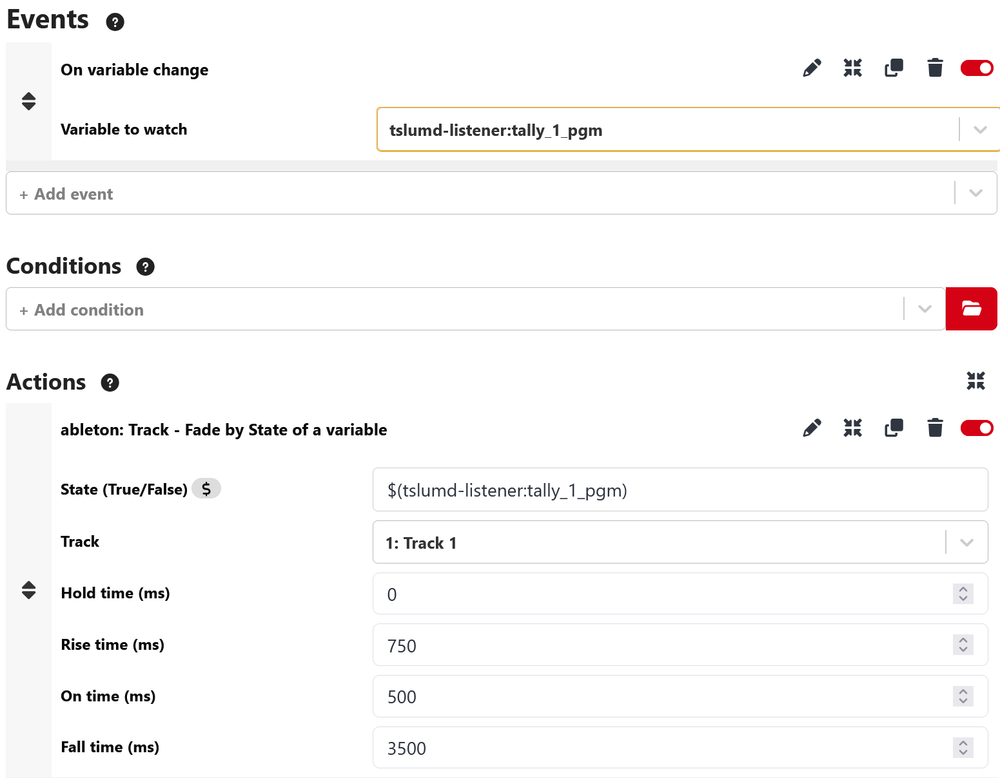

# Advanced Fading: Fade Track by State

This module includes a powerful action called **Fade Track by State**, also called Audio follow Video. It allows you to automate audio fades (In and Out) based on the value of a Companion variable.

This is particularly useful for broadcast workflows where you want to automatically open a microphone when a camera goes ON AIR, and close it when it goes OFF AIR.

## The Concept

The action monitors a specific variable (the "State").

* When the variable becomes **True** (or `1`, `on`), the track **Fades In**.
* When the variable becomes **False** (or `0`, `off`), the track **Fades Out**.

## Example Scenario: Camera Tally

Let's say you have a camera connected to your switcher, and you are using a Companion module (like `umd-listener` or a switcher module) to get the Tally status.

* **Variable**: `$(umd:tally_1)`
* **Value**: Returns `true` when Camera 1 is ON AIR, and `false` when it is OFF AIR.

### Step-by-Step Setup

1. **Create a Trigger** in Companion.
2. **Event**: Select "On condition becoming true".
3. **Condition**: Choose "Variable value changed".
    * Variable: `$(umd:tally_1)`
    * (Or simply use the Trigger to fire whenever the variable changes).
4. **Action**: Add the action **Ableton Live (OSC): Fade Track by State**.
5. **Configure the Action**:
    * **State**: Enter the variable name: `$(umd:tally_1)`.
    * **Track**: Select the audio track corresponding to Camera 1 (e.g., "Cam 1 Mic").
    * **Time Parameters**: Configure the 4 timing values (see below).

## The 4 Temporal Parameters

To give you full control over the fade, there are 4 time settings. Here is how they work in chronological order:

### 1. Hold Time (Delay before Fade In)

* **When it happens**: Immediately after the variable becomes **True**.
* **What it does**: Waits for X milliseconds before starting the fade in.
* **Usage**: Useful if you want to wait for the camera cut to fully complete before opening the audio, or to avoid "clipping" if the director cuts away quickly.

### 2. Rise Time (Fade In Duration)

* **When it happens**: After the Hold Time is finished.
* **What it does**: The time it takes for the volume to go from $-\infty$ dB to 0 dB (or the previous volume).
* **Usage**: A smooth fade-in (e.g., 500ms or 1000ms) is less abrupt than a hard cut.

### 3. On Time (Delay before Fade Out)

* **When it happens**: Immediately after the variable becomes **False**.
* **What it does**: Keeps the audio ON for X milliseconds *after* the camera goes off air.
* **Usage**: This is critical for "trailing audio". It ensures that if the person is still finishing a sentence as the camera cuts away, they aren't cut off abruptly. It acts like a "cough button" release delay.

### 4. Fall Time (Fade Out Duration)

* **When it happens**: After the On Time is finished.
* **What it does**: The time it takes for the volume to fade down to $-\infty$ dB.
* **Usage**: A slow fade out (e.g., 3500ms) sounds natural.

## Visual Timeline

```text
Variable:   [FALSE] ----------------> [TRUE] -------------------------> [FALSE] ----------------->
Timeline:            | Hold |  Rise  |           (Audio ON)            |  On Time  |   Fall   |
Volume:     [Mute] --|______|/ / / / |_________________________________|___________|\ \ \ \ \ |__ [Mute]
```

## Example Configuration

